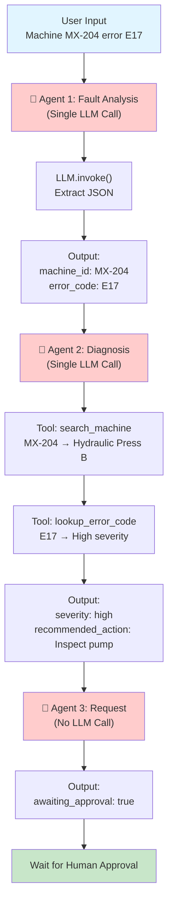
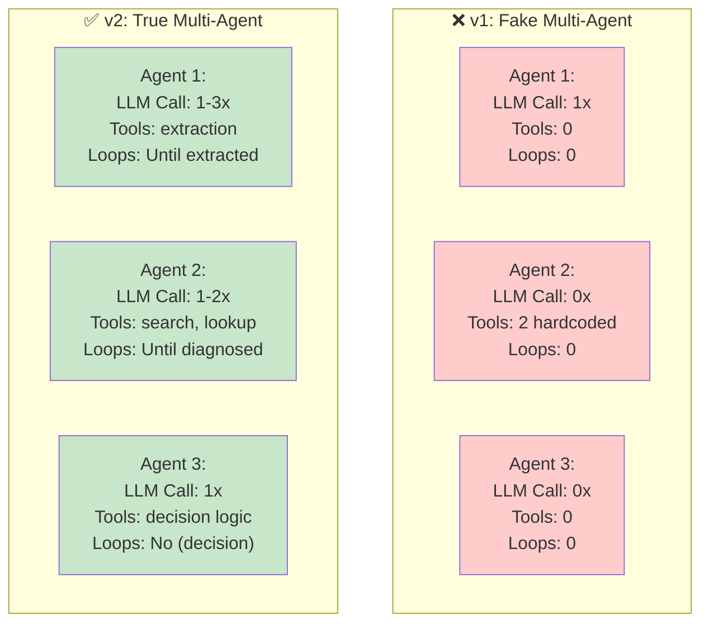

# Agent Architecture Diagrams

## v1: Fake Multi-Agent (Sequential Tool Pipeline)



**Problems with v1:**
- ❌ Agent 1: Only calls LLM once → Not a real agent
- ❌ Agent 2: Just executes tools, doesn't reason → Not a real agent
- ❌ Agent 3: No LLM at all → Definitely not an agent
- ❌ No loops or reasoning
- ❌ No tool selection (tools hardcoded)
- ❌ No decision-making

---

## v2: True Multi-Agent (Modern LangGraph)

```mermaid
graph TD
    Start["User Input<br/>Machine MX-204 error E17"] --> Agent1
    
    Agent1["🧠 AGENT 1: Fault Analysis Agent<br/><br/>Input: user_input<br/>Process: Reasoning Loop"]
    
    Agent1 --> A1_Think["Think:<br/>Need to extract machine info"]
    A1_Think --> A1_Tool1["Tool: LLM Extraction<br/>invoke LLM"]
    A1_Tool1 --> A1_Obs["Observe Result:<br/>machine_id, error_code"]
    A1_Obs --> A1_Decide{"Extracted<br/>successfully?"}
    A1_Decide -->|No, retry| A1_Tool1
    A1_Decide -->|Yes| A1_Out["Output: fault_analysis<br/>Messages: [extracted data]"]
    
    A1_Out --> State1["🔄 Shared State Update<br/>fault_analysis: {<br/>  machine_id: MX-204<br/>  error_code: E17<br/>}"]
    
    State1 --> Agent2
    
    Agent2["🧠 AGENT 2: Diagnosis Agent<br/><br/>Input: fault_analysis<br/>Process: Reasoning + Tool Loop"]
    
    Agent2 --> A2_Think["Think:<br/>Need machine data & error details"]
    A2_Think --> A2_Decide_Tools{"Which tools<br/>to call?"}
    A2_Decide_Tools --> A2_Tool1["Tool: search_machine<br/>search machines.json"]
    A2_Tool1 --> A2_Obs1["Observe:<br/>Hydraulic Press B"]
    A2_Obs1 --> A2_Tool2["Tool: lookup_error_code<br/>search error_codes.json"]
    A2_Tool2 --> A2_Obs2["Observe:<br/>severity: high"]
    A2_Obs2 --> A2_Reason["Reason:<br/>High severity → immediate action needed"]
    A2_Reason --> A2_Out["Output: diagnosis<br/>severity: high<br/>recommended_action: ..."]
    
    A2_Out --> State2["🔄 Shared State Update<br/>diagnosis: {<br/>  severity: high<br/>  root_cause: pump seal<br/>}"]
    
    State2 --> Agent3
    
    Agent3["🧠 AGENT 3: Request Agent<br/><br/>Input: diagnosis + fault_analysis<br/>Process: Decision Making"]
    
    Agent3 --> A3_Think["Think:<br/>Should create ticket but need approval"]
    A3_Think --> A3_Decide["Decide:<br/>Set awaiting_approval = true"]
    A3_Decide --> A3_Out["Output:<br/>awaiting_approval: true<br/>final_response: ..."]
    
    A3_Out --> State3["🔄 Shared State Update<br/>awaiting_approval: true<br/>messages: [full history]"]
    
    State3 --> End["⏳ Workflow Paused<br/>Waiting for Human Approval"]
    
    style Agent1 fill:#bbdefb
    style Agent2 fill:#bbdefb
    style Agent3 fill:#bbdefb
    style Start fill:#e1f5ff
    style End fill:#fff9c4
    style State1 fill:#c8e6c9
    style State2 fill:#c8e6c9
    style State3 fill:#c8e6c9
    style A1_Think fill:#f5f5f5
    style A1_Tool1 fill:#ffe0b2
    style A2_Think fill:#f5f5f5
    style A2_Tool1 fill:#ffe0b2
    style A2_Tool2 fill:#ffe0b2
```



**Improvements in v2:**
- ✅ Agent 1: Can reason and loop
- ✅ Agent 2: Can decide which tools to use
- ✅ Agent 3: Makes decisions autonomously
- ✅ Each agent reads shared state
- ✅ Each agent updates shared state
- ✅ LangGraph merges state changes
- ✅ Full message history for context
- ✅ True multi-agent system

---

## Detailed Agent Decision Flow

### Agent 2 (Diagnosis) - Showing Reasoning

```mermaid
graph TD
    Input["Receive State:<br/>machine_id: MX-204<br/>error_code: E17"] --> Think1["🧠 THINK:<br/>I have machine_id and error_code<br/>I need to find:<br/>1. Machine specs<br/>2. Error details<br/>3. Severity level"]
    
    Think1 --> Decide1["🎯 DECIDE:<br/>Call search_machine tool"]
    Decide1 --> Act1["⚙️ ACT:<br/>search_machine(MX-204)"]
    Act1 --> Obs1["👁️ OBSERVE:<br/>Machine found: Hydraulic Press B<br/>Status: operational<br/>Location: Building A"]
    
    Obs1 --> Think2["🧠 THINK:<br/>Good! Found machine info<br/>Now need error details"]
    Think2 --> Decide2["🎯 DECIDE:<br/>Call lookup_error_code tool"]
    Decide2 --> Act2["⚙️ ACT:<br/>lookup_error_code(E17)"]
    Act2 --> Obs2["👁️ OBSERVE:<br/>Error E17: Low hydraulic pressure<br/>Severity: high<br/>Action: Inspect pump seal"]
    
    Obs2 --> Think3["🧠 THINK:<br/>I now have all info:<br/>- Machine: Hydraulic Press B<br/>- Error: E17<br/>- Severity: HIGH<br/>- Recommended: Inspect pump<br/>I can now output diagnosis"]
    
    Think3 --> Output["📤 OUTPUT:<br/>diagnosis: {<br/>  severity: 'high'<br/>  root_cause: 'pump seal'<br/>  action: 'inspect pump'<br/>}"]
    
    style Input fill:#e1f5ff
    style Think1 fill:#f3e5f5
    style Think2 fill:#f3e5f5
    style Think3 fill:#f3e5f5
    style Decide1 fill:#fff3e0
    style Decide2 fill:#fff3e0
    style Act1 fill:#ffe0b2
    style Act2 fill:#ffe0b2
    style Obs1 fill:#c8e6c9
    style Obs2 fill:#c8e6c9
    style Output fill:#c8e6c9
```



---

## State Flow Through Agents

```mermaid
graph LR
    subgraph Init["🔵 Initial State"]
        I["user_input: 'Machine...'<br/>messages: [user msg]<br/>fault_analysis: {}<br/>diagnosis: {}<br/>awaiting_approval: false"]
    end
    
    subgraph A1["🤖 Agent 1 Process"]
        A1S["Reads: user_input<br/>Reasons: Extract info<br/>Returns: fault_analysis"]
    end
    
    subgraph S1["🔄 State After Agent 1"]
        S1V["user_input: 'Machine...'<br/>fault_analysis: {<br/>  machine_id: MX-204<br/>  error_code: E17<br/>}<br/>messages: [user, agent1]"]
    end
    
    subgraph A2["🤖 Agent 2 Process"]
        A2S["Reads: fault_analysis<br/>Tools: search, lookup<br/>Reasons: Diagnose<br/>Returns: diagnosis"]
    end
    
    subgraph S2["🔄 State After Agent 2"]
        S2V["fault_analysis: {...}<br/>diagnosis: {<br/>  severity: high<br/>  root_cause: pump<br/>}<br/>messages: [user, a1, a2]"]
    end
    
    subgraph A3["🤖 Agent 3 Process"]
        A3S["Reads: diagnosis<br/>Decides: Await approval<br/>Returns: awaiting_approval"]
    end
    
    subgraph S3["🔄 Final State"]
        S3V["diagnosis: {...}<br/>awaiting_approval: true<br/>final_response: '...'<br/>messages: [full history]"]
    end
    
    Init --> A1
    A1 --> S1
    S1 --> A2
    A2 --> S2
    S2 --> A3
    A3 --> S3
    
    style Init fill:#e1f5ff
    style A1 fill:#bbdefb
    style A2 fill:#bbdefb
    style A3 fill:#bbdefb
    style S1 fill:#c8e6c9
    style S2 fill:#c8e6c9
    style S3 fill:#fff9c4
```



---

## Agent Tool Usage Comparison



---

## LangSmith Tracing View

What you'll see in LangSmith Studio when Agent 2 runs:

```
Level 3 Workflow (Thread: fault_1234567890)
├── Agent 1: Fault Analysis
│   ├── LLM Call: extract_fault_info
│   │   ├── Input: "Machine MX-204 error E17..."
│   │   └── Output: {machine_id: "MX-204", error_code: "E17"}
│   └── Duration: 1.2s
│
├── Agent 2: Diagnosis  ← You are here
│   ├── Reasoning Step 1:
│   │   └── "Need machine and error data"
│   ├── Tool Call 1: search_machine
│   │   ├── Input: "MX-204"
│   │   └── Output: {name: "Hydraulic Press B", status: "operational"}
│   ├── Reasoning Step 2:
│   │   └── "Found machine, now need error details"
│   ├── Tool Call 2: lookup_error_code
│   │   ├── Input: "E17"
│   │   └── Output: {severity: "high", action: "Inspect pump"}
│   ├── Reasoning Step 3:
│   │   └── "Have all data, can diagnose now"
│   └── Duration: 0.8s
│
├── Agent 3: Request
│   ├── Decision: Await approval
│   └── Duration: 0.1s
│
└── Total: 2.1s
```

You'll see **all reasoning steps, tool calls, and decisions** visualized!

---

## Summary

| Aspect | v1 (Fake) | v2 (Real) |
|--------|-----------|-----------|
| **Reasoning** | ❌ None | ✅ Full reasoning loops |
| **Tool Selection** | ❌ Hardcoded | ✅ Agent decides |
| **Loops** | ❌ No | ✅ Think-Act-Observe |
| **Independence** | ❌ No | ✅ Autonomous agents |
| **Message History** | ❌ None | ✅ Full context |
| **LangSmith Visibility** | ❌ Basic | ✅ Detailed traces |
| **True Multi-Agent** | ❌ No | ✅ Yes |

